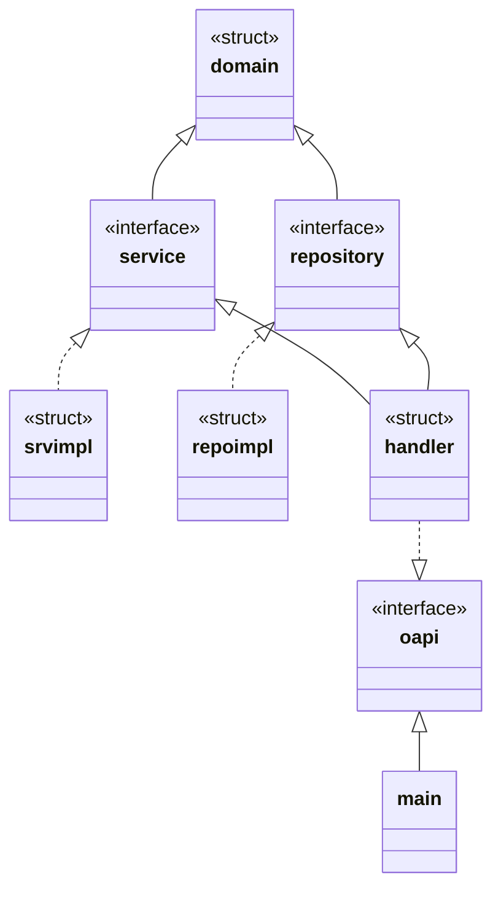

# hackathon-22-winter-01

## 必要環境

- Go 1.19

## 開発者メモ

- [openapi](./docs/openapi/v1.yml)を変更したら`go generate ./...`を実行

### 依存図

←: 依存
⇠: 実装

```mermaid
classDiagram

class domain { <<struct>> }
class service { <<interface>> }
class srvimpl { <<struct>> }
class repository { <<interface>> }
class repoimpl { <<struct>> }
class handler { <<struct>> }
class oapi { <<interface>> }

domain <|-- service
domain <|-- repository
service <|.. srvimpl
repository <|.. repoimpl
service <|-- handler
repository <|-- handler
handler ..|> oapi
oapi <|-- main
```
