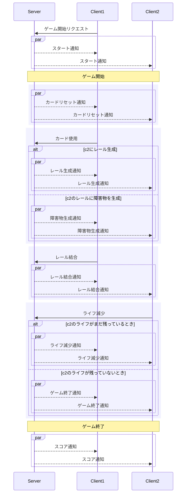

# Websocket 仕様書

実線: クライアント→サーバー
破線: サーバー→クライアント

```mermaid
sequenceDiagram
  participant s as Server
  participant c1 as Client1
  participant c2 as Client2

  c1->>s: ゲーム開始リクエスト
  par
    s-->>c1: スタート通知
    s-->>c2: スタート通知
  end

  note over s, c2: ゲーム開始

  rect rgba(0,0,256,0.05)
    par
      s-->>c1: カードリセット通知
      s-->>c2: カードリセット通知
    end
  end

  rect rgba(0,0,256,0.05)
    c1->>s: カード使用
    alt c2にレール生成
      par
        s-->>c1: レール生成通知
        s-->>c2: レール生成通知
      end
    else c2のレールに障害物を生成
      par
        s-->>c1: 障害物生成通知
        s-->>c2: 障害物生成通知
      end
    end
  end

  rect rgba(0,0,256,0.05)
    c1->>s: レール結合
    par
      s-->>c1: レール結合通知
      s-->>c2: レール結合通知
    end
  end

  rect rgba(0,0,256,0.05)
    c2->>s: ライフ減少
    alt c2のライフがまだ残っているとき
      par
        s-->>c1: ライフ減少通知
        s-->>c2: ライフ減少通知
      end
    else c2のライフが残っていないとき
      par
        s-->>c1: ゲーム終了通知
        s-->>c2: ゲーム終了通知
      end
    end
  end

  note over s, c2: ゲーム終了

  par
    s-->>c1: スコア通知
    s-->>c2: スコア通知
  end
```
